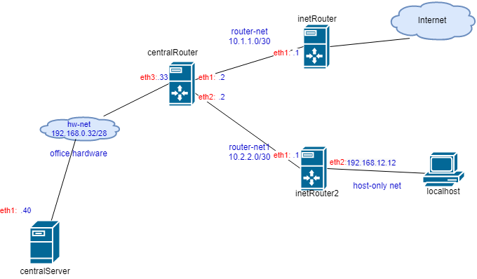

**Задание**

1) реализовать knocking port
- centralRouter может попасть на ssh inetrRouter через knock скрипт
пример в материалах
2) добавить inetRouter2, который виден(маршрутизируется (host-only тип сети для виртуалки)) с хоста или форвардится порт через локалхост
3) запустить nginx на centralServer
4) пробросить 80й порт на inetRouter2 8080
5) дефолт в инет оставить через inetRouter

* реализовать проход на 80й порт без маскарадинга

**Выполнение задания**

Выполним настройку iptables на inetRouter:
```
# Маскарадим весь трафик, идущий через eth0,разрешаем ssh и пропускаем ответные пакеты в соединениях, инициированных из внутренней сети.
[root@inetRouter ~]# iptables -t nat -A POSTROUTING -o eth0 -j MASQUERADE
[root@inetRouter ~]# iptables -A INPUT -p tcp --dport 22 -j ACCEPT
[root@inetRouter ~]# iptables -I FORWARD -m conntrack --ctstate ESTABLISHED,RELATED -j ACCEPT
# Зададим политику по умолчанию для INPUT и FORWARD цепочкек DROP
[root@inetRouter ~]# iptables -P INPUT DROP
[root@inetRouter ~]# iptables -P FORWARD DROP
```
Установим пакет `iptables-services` ,чтобы релизовать автозагрузку данного правила после перезагрузки сервера.
```
[root@inetRouter ~]# yum install -y iptables-services
[root@inetRouter ~]# systemctl enable --now iptables
```
При загрузке сервера iptables.service будет считывать содержимое файла `/etc/sysconfig/iptables`. Для сохранения в этот файл настроенного выше правила nat воспользуемся утилитой `iptables-save`:
```
[root@inetRouter ~]# iptables-save > /etc/sysconfig/iptables
```

***1. Реализовать knocking port. centralRouter может попасть на ssh inetrRouter через knock скрипт***

Разрешим на inetRouter ssh и создадим пользователя user1:
```
[root@inetRouter ~]# useradd user1
[root@inetRouter ~]# echo "user" | passwd --stdin user1
[root@inetRouter ~]# sed -i 's/^PasswordAuthentication.*$/PasswordAuthentication yes/' /etc/ssh/sshd_config && systemctl restart sshd.service
```
Идея механизма knocking port состоит в создании определенной пвсевдослучайной последовательности действий, правильно выполнив которую инициирующая соединение стороноа-сможет получить доступ внутрь сети. В нашем случае логика работы будет заключаться в следующем: с сервера `centralRouter` будут последовательно выполнены 3 запроса на установку соединения на закрытые порты 8882, 7772, 9992 (это верная последовательность) с помощью утилиты `nmap`, эти входящие запросы будут отслеживаться модулем **recent** в `iptables`, и если последовательность верна, то на 30 секунд откроется порт 22 для подключения к серверу по ssh.
Для реализации `Port knocking` необходимо дополнительно создать три цепочки в таблице `filter`: `TRAFFIC`, `SSH-INPUT`, `SSH-INPUTTWO`:
```
[root@inetRouter ~]# iptables -N TRAFFIC
[root@inetRouter ~]# iptables -N SSH-INPUT
[root@inetRouter ~]# iptables -N SSH-INPUTTWO
```
Добавим следующие правила:
```
[root@inetRouter ~]# iptables -A INPUT -j TRAFFIC
[root@inetRouter ~]# iptables -A TRAFFIC -m conntrack --ctstate ESTABLISHED,RELATED -j ACCEPT
[root@inetRouter ~]# iptables -A TRAFFIC -m conntrack --ctstate NEW -m tcp -p tcp --dport 22 -m recent --rcheck --seconds 30 --name SSH2 -j ACCEPT
```
Под первое правило попадают все входящие пакеты, не обработанные настроенными ранее правилами.
Второе правило нужно для разрешения пакетов уже установленных соединений.
Третье правило открывает для новых входящих подключений 22й порт на 30 секунд, если подключающийся IP есть в списке **SSH2**.

Следующее правило отрабатывает, если в течение 30 секунд не было попытки подключения на порт 22, подключающийся IP, присутствующий в списке **SSH2**, удаляется из этого списка, и ему заново нужно будет пройти всю последовательность портов:
```
[root@inetRouter ~]# iptables -A TRAFFIC -m conntrack --ctstate NEW -m tcp -p tcp -m recent --name SSH2 --remove -j DROP
```
Следующие правила выполняют проверку последовательности портов. Пакеты на неверные порты последовательности дропаются:
```
[root@inetRouter ~]# iptables -A TRAFFIC -m conntrack --ctstate NEW -m tcp -p tcp --dport 9992 -m recent --rcheck --name SSH1 -j SSH-INPUTTWO
[root@inetRouter ~]# iptables -A TRAFFIC -m conntrack --ctstate NEW -m tcp -p tcp -m recent --name SSH1 --remove -j DROP
[root@inetRouter ~]# iptables -A TRAFFIC -m conntrack --ctstate NEW -m tcp -p tcp --dport 7772 -m recent --rcheck --name SSH0 -j SSH-INPUT
[root@inetRouter ~]# iptables -A TRAFFIC -m conntrack --ctstate NEW -m tcp -p tcp -m recent --name SSH0 --remove -j DROP
```
В финальном наборе правил выполняется проверка на первый "стук". В случае успеха (правильнй порт) IP адрес  из входящего соединения заносится в первый список **SSH0**. Со вторым "стуком" в случае успеха подключающийся IP адрес попадает в список **SSH1**, а с третьим - в **SSH2**:
```
[root@inetRouter ~]# iptables -A TRAFFIC -m conntrack --ctstate NEW -m tcp -p tcp --dport 8882 -m recent --name SSH0 --set -j DROP
[root@inetRouter ~]# iptables -A SSH-INPUT -m recent --name SSH1 --set -j DROP
[root@inetRouter ~]# iptables -A SSH-INPUTTWO -m recent --name SSH2 --set -j DROP
[root@inetRouter ~]# iptables -A TRAFFIC -j DROP
```
Удалим созданное в самом начале правило, разрешающее ssh:
```
[root@inetRouter ~]# iptables -A INPUT -p tcp --dport 22 -j ACCEPT
```
В результате правила iptables на сервере `inetRouter` будут выглядеть следующим образом:
```
[root@inetRouter ~]# iptables-save
.....
:INPUT DROP [0:0]
:FORWARD DROP [0:0]
:OUTPUT ACCEPT [6:472]
:SSH-INPUT - [0:0]
:SSH-INPUTTWO - [0:0]
:TRAFFIC - [0:0]
-A INPUT -j TRAFFIC
-A FORWARD -m conntrack --ctstate RELATED,ESTABLISHED -j ACCEPT
-A FORWARD -i eth1 -j ACCEPT
-A SSH-INPUT -m recent --set --name SSH1 --mask 255.255.255.255 --rsource -j DROP
-A SSH-INPUTTWO -m recent --set --name SSH2 --mask 255.255.255.255 --rsource -j DROP
-A TRAFFIC -m conntrack --ctstate RELATED,ESTABLISHED -j ACCEPT
-A TRAFFIC -p tcp -m conntrack --ctstate NEW -m tcp --dport 22 -m recent --rcheck --seconds 30 --name SSH2 --mask 255.255.255.255 --rsource -j ACCEPT
-A TRAFFIC -p tcp -m conntrack --ctstate NEW -m tcp -m recent --remove --name SSH2 --mask 255.255.255.255 --rsource -j DROP
-A TRAFFIC -p tcp -m conntrack --ctstate NEW -m tcp --dport 9992 -m recent --rcheck --name SSH1 --mask 255.255.255.255 --rsource -j SSH-INPUTTWO
-A TRAFFIC -p tcp -m conntrack --ctstate NEW -m tcp -m recent --remove --name SSH1 --mask 255.255.255.255 --rsource -j DROP
-A TRAFFIC -p tcp -m conntrack --ctstate NEW -m tcp --dport 7772 -m recent --rcheck --name SSH0 --mask 255.255.255.255 --rsource -j SSH-INPUT
-A TRAFFIC -p tcp -m conntrack --ctstate NEW -m tcp -m recent --remove --name SSH0 --mask 255.255.255.255 --rsource -j DROP
-A TRAFFIC -p tcp -m conntrack --ctstate NEW -m tcp --dport 8882 -m recent --set --name SSH0 --mask 255.255.255.255 --rsource -j DROP
-A TRAFFIC -j DROP
COMMIT
...
*nat
:PREROUTING ACCEPT [507:39436]
:INPUT ACCEPT [6:812]
:OUTPUT ACCEPT [396:30152]
:POSTROUTING ACCEPT [1:35]
-A POSTROUTING -o eth0 -j MASQUERADE
COMMIT

```
Сохраним правила iptables, чтобы они автоматически восстанавливались после перезагрузки сервера:
```
[root@inetRouter ~]# service iptables save
iptables: Saving firewall rules to /etc/sysconfig/iptables:[  OK  ]
```
Зайдем на соседний роутер и проверим доступ по механизму knocking port:
```
[root@centralRouter ~]# nmap -Pn --max-retries 0 -p 8882 10.1.1.1

Starting Nmap 6.40 ( http://nmap.org ) at 2020-11-19 08:16 UTC
...
Nmap done: 1 IP address (1 host up) scanned in 0.37 seconds
[root@centralRouter ~]# nmap -Pn --max-retries 0 -p 7772 10.1.1.1

Starting Nmap 6.40 ( http://nmap.org ) at 2020-11-19 08:18 UTC
...
Nmap done: 1 IP address (1 host up) scanned in 0.36 seconds
[root@centralRouter ~]# nmap -Pn --max-retries 0 -p 9992 10.1.1.1

Starting Nmap 6.40 ( http://nmap.org ) at 2020-11-19 08:20 UTC
...
Nmap done: 1 IP address (1 host up) scanned in 0.36 seconds
[root@centralRouter ~]# ssh user1@10.1.1.1
user1@10.1.1.1's password:
Last login: Thu Nov 19 08:06:50 2020 from 10.1.1.2
[user1@inetRouter ~]$ exit
```
Как видим, мы успешно подключились по ssh под пользователем user1.

Если же попробовать подключиться без "простукивания" портов, то соединение не установится:
```
[root@centralRouter ~]# ssh user1@10.1.1.1


^C
[root@centralRouter ~]#
```
Для автоматизации процедуры `Port knocking` создадим скрипт `knock.sh` на `centralRouter`:
```
[root@centralRouter ~]# cat /opt/knock.sh
#!/bin/bash
HOST=$1
shift
for PORT in "$@"
do
	nmap -Pn --max-retries 0 -p $PORT $HOST
done
[root@centralRouter ~]# chmod +x /opt/knock.sh
```
Подключимся к `inetRouter` с помощью нашего скрипта:
```
[root@centralRouter ~]# /opt/knock.sh 10.1.1.1 8882 7772 9992 && ssh user1@10.1.1.1

Starting Nmap 6.40 ( http://nmap.org ) at 2020-11-19 08:40 UTC
Warning: 10.1.1.1 giving up on port because retransmission cap hit (0).
Nmap scan report for 10.1.1.1
Host is up (0.00049s latency).
PORT     STATE    SERVICE
8882/tcp filtered unknown
MAC Address: 08:00:27:03:60:A8 (Cadmus Computer Systems)

Nmap done: 1 IP address (1 host up) scanned in 0.40 seconds

Starting Nmap 6.40 ( http://nmap.org ) at 2020-11-19 08:40 UTC
Warning: 10.1.1.1 giving up on port because retransmission cap hit (0).
Nmap scan report for 10.1.1.1
Host is up (0.00040s latency).
PORT     STATE    SERVICE
7772/tcp filtered unknown
MAC Address: 08:00:27:03:60:A8 (Cadmus Computer Systems)

Nmap done: 1 IP address (1 host up) scanned in 0.39 seconds

Starting Nmap 6.40 ( http://nmap.org ) at 2020-11-19 08:40 UTC
Warning: 10.1.1.1 giving up on port because retransmission cap hit (0).
Nmap scan report for 10.1.1.1
Host is up (0.00033s latency).
PORT     STATE    SERVICE
9992/tcp filtered issc
MAC Address: 08:00:27:03:60:A8 (Cadmus Computer Systems)

Nmap done: 1 IP address (1 host up) scanned in 0.40 seconds
user1@10.1.1.1's password:
Last login: Thu Nov 19 08:21:39 2020 from 10.1.1.2

```

***2. Добавить inetRouter2, который виден(маршрутизируется (host-only тип сети для виртуалки)) с хоста или форвардится порт через локалхост***

***3. Запустить nginx на centralServer***

***4. Пробросить 80й порт на inetRouter2 8080***

***5. Дефолт в инет оставить через inetRouter***

**\* реализовать проход на 80й порт без маскарадинга**

Схема сети выглядит следующим образом:



Установим и запустим nginx на `centralServer`:
```
[root@centralServer ~]# yum install -y epel-release
[root@centralServer ~]# yum install -y nginx
[root@centralServer ~]# systemctl enable --now nginx
```
Установим `iptables-services`:
```
[root@inetRouter2 ~]# yum install -y iptables-services
[root@inetRouter2 ~]# systemctl enable --now iptables
```
Реализуем проход на 80й порт сервера `centralServer` при подключении на порт 8080 сервера `inetRouter2`. Для этого в цепочку `PREROUTING` таблицы `nat` на сервере  `inetRouter2` необходимо добавить следующее правило (также очистим на всякий случай таблицу `filter`):
```
[root@inetRouter2 ~]# iptables -t nat -A PREROUTING -i eth2 -p tcp --dport 8080 -j DNAT --to 192.168.0.40:80
[root@inetRouter2 ~]# iptables -F
```
При загрузке сервера iptables.service будет считывать содержимое файла `/etc/sysconfig/iptables`. Для сохранения в этот файл настроенного выше правила nat воспользуемся утилитой `iptables-save`:
```
[root@inetRouter2 ~]# service iptables save
iptables: Saving firewall rules to /etc/sysconfig/iptables:[  OK  ]
```
Проверим:


При этом дефолтом в инет является 10.1.1.1 (inetRouter):
```
[root@centralServer ~]# traceroute otus.ru
traceroute to otus.ru (95.213.229.86), 30 hops max, 60 byte packets
 1  gateway (192.168.0.33)  0.944 ms  0.815 ms  0.508 ms
 2  10.1.1.1 (10.1.1.1)  1.273 ms  1.302 ms  1.411 ms
 3  * * *
 4  * * *
 5  * * *
 6  Core-Len-Vlan7.spark-rostov.ru (86.110.173.81)  5.740 ms  5.186 ms  5.153 ms
 7  Core-Center-Vlan5-40G.spark-rostov.ru (86.110.173.21)  6.625 ms  6.608 ms  6.589 ms
 8  rnd03sb-vlan11-80g.spark.ttk.ru (86.110.173.9)  5.003 ms  6.424 ms  5.028 ms
 9  rnd-nat09-eth1-down.spark.ttk.ru (86.110.185.91)  3.902 ms  3.889 ms  8.426 ms
10  rnd-ix-jmx480-ae1-69.spark.ttk.ru (93.189.12.66)  14.272 ms  14.254 ms  14.207 ms
11  rdn06rb.transtelecom.net (188.43.14.254)  11.746 ms  11.716 ms  12.226 ms
12  spb01.transtelecom.net (188.43.1.226)  37.129 ms  31.173 ms  33.244 ms
13  Selectel-gw.transtelecom.net (188.43.1.225)  36.027 ms  31.709 ms  35.897 ms
14  92.53.93.121 (92.53.93.121)  82.923 ms  52.864 ms  52.734 ms
15  95.213.229.86 (95.213.229.86)  42.114 ms  40.654 ms  37.797 ms
16  95.213.229.86 (95.213.229.86)  39.764 ms  31.617 ms  440.511 ms

```

**Проверка задания**

для проверки достаточно стартовать все виртуалки в Вагрант, зайти на `centralRouter` с помощью `vagrant ssh centralRouter`, выполнить `/opt/knock.sh 10.1.1.1 8882 7772 9992`, затем `ssh user1@10.1.1.1` и ввести пароль `user`. Тем самым попадем на сервер `inetRouter`. В консоли или браузере на локалхосте зайти по адресу `http://192.168.12.12:8080`.
